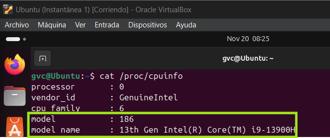
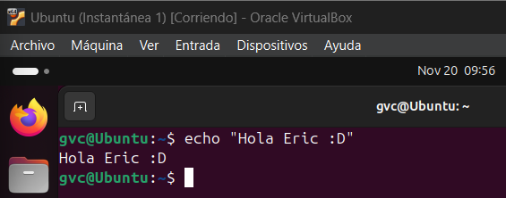
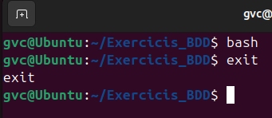
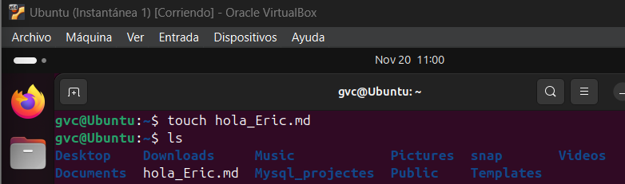
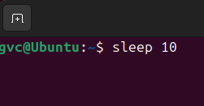
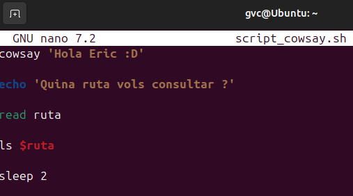
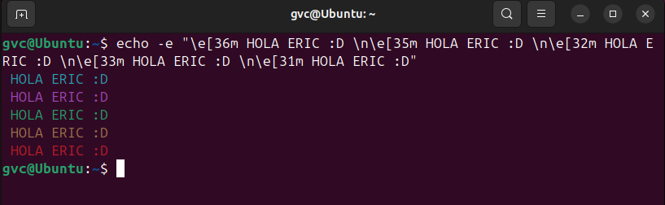

# M01-AA1.1.1-Pràctica

## Computadors

#### 1. Quina és la diferència principal entre una GPU i una CPU?
```
La diferència principal es que la CPU processa càlculs de forma seqüencial, en canvi la GPU fa molts càlculs a l'hora ja que processa les operacions en forma de matriu.
```
#### 2. Què és la memòria RAM i què implica que tingui accés aleatori a la memòria en comparació a la memòria d’emmagatzematge?

```
Es un tipus de memòria volàtil d'accés aleatori (Random Access Memory) que s'utilitza en dispositius electrònics.
S'utilitza per a emmagatzemar temporalment dades i instruccions als que es necessari que la CPU pugui accedir ràpidament durant la execució de programes i processos.

Que sigui d'accés alesatori significa que la CPU pot accedir a qualsevol ubicació de la memòria de manera directa i gairebé instantània, en comptes d'haver de buscar seqüencialment com en les memòries d'emmagatzematge.
```

#### 3. Utilitza les comandes Bash vistes a classe i una màquina virtual amb Linux per a consultar el model de la CPU a través de comandes Bash.

```
Podem veure el model de CPU que tenim mitjançant: cat /proc/cpuinfo


```

## Sistemes operatius

#### 4. Per què creus que els sistemes operatius més utilitzats en dispositius incrustats estan basats en UNIX, així com en servidors i en consoles?

```
Perquè aquests tipus de dispositius solen tenir necessitats molt específiques, com molt poc espai d'emmagatzematge, i altres sistemes operatius no permeten ser modificats, o no tant, per adaptar-los a les necessitats d'aquests.
```

#### 5. Busca a internet algun exemple del sistema operatiu que podem trobar en un cotxe, en un dispositiu Wi-Fi i en un servidor

```
Cotxe: els cotxes utilitzen un software integrat (software embegut) que possibilita l'execució de diversos dispositius electrònics.
Aquest software utilitza diversos sistemes operatius entre els que destaquen els sistemes operatius en temps real (RTOS) com el QNX.
QNX es un sistema operatiu en temps real comercial tipus UNIX utilitzat tant en cotxes com en altres dispositius electrònics.

Dispositiu Wi-Fi: els dispositius Wi-fi utilitzen un sistema operatiu en xarxa (NOS) que permet la interconexió d'ordinadors.
Un exemple es el Cisco IOS que sistema operatiu en xarxa amb arquitectura monolítica (model tradicional unificat per al disseny del software d'un programa) i un kernel personalitzat.

Servidor: en el cas dels servidors hi moltes opcions disponibles al mercat, sent Linux i Windows els més utilitzats.
```

## Llicències de programari

#### 6. Busca el repositori oficial d’un programa de codi obert (exemple: Firefox o GIMP), i explica:

**a. Quina llicència utilitza. Explica en què consisteix.**

```
Mozilla es un software open source i free software, el que significa que es pot descarregar (ús), estudiar, modificar i distribuir, en aquest cas la redistribució queda subjecte a certes restriccions.
```

**b. Podries modificar el seu codi font? Per què?**

```
Si, ja que al ser un software open source i free software, permet la modificació del software.
```

**c. Explica quina diferència hi hauria si aquest programa fos propietari.**

```
Al ser un software propietari tindria restriccions en l'ús, estudi, modificació i distribució, ja que normalment per aquest tipus de software es requereix un pagament per a l'ús, no es permet ni la modificació ni la distribució i el seu codi no sol ser públic.
```

#### 7. Quins punts engloba la filosofia UNIX que hem vist a classe?

```
La filosofia UNIX, abans de ser un sistema operatiu privatiu, es basava en el lliure ús, estudi, modificació i distribució.
```

## Comandes Bash

#### 8. Documenta i explica l'ús de les comandes “echo”, “bash”, “touch”, “read”, “sleep”.

```
"echo": mostra text per pantalla.



"bash": executa el programa Bash.



"touch": crea un nou arxiu.



"read": llegeix la informació introduida amb el teclat i la guarda en una variable.


"sleep": pausa un procés durant el temps especificat per l'usuari.



```

#### 9. Fes un script amb “nano” d’una vaca que saluda i mostra el contingut del directori que demana. Necessitaràs les comandes vistes en el punt anterior.

**a. La vaca saluda.**

**b. El programa pregunta a l’usuari quina ruta vol consultar i guarda la resposta en una variable**

**c. El programa confia que la ruta existeix i mostra el seu contingut.**

**d. El programa s’espera 2 segons.**

```


```

#### 10. Investiga com pots mostrar el resultat d’una comanda amb un altre color i explica cada paràmetre que has utilitzat.

```
Per a canvia el color del resultat d'una comanda s'utilitza: -e "\e[36m HOLA ERIC :D"

-e: permet que el codi del color s'interpreti com a tal.

\e[36m: es el codi que indica el color al que canviarà el text.

"": encapsula el codi de color i el text per a que pugui ser interpretat per la comanda.
```
**a. Posa exemples usant altres colors.**

```

```

## Control de versions

#### 11. Utilització de llenguatge markdown per a elaborar documentació tècnica (sintaxi correcta per als títols, subtítols, imatges i exemples de codi).

## Webgrafia

```
https://www.pccomponentes.com/memorias-ram-caracteristicas?srsltid=AfmBOooi36SU_L8EKB-0rI2CQ_Fpou3pKC3u8mI_uc4GvLNClq6dYOoD

https://geekytheory.com/obtener-datos-de-la-cpu-en-linux-de-8-formas-diferentes/

https://rleiberia.es/que-es-embedded-sw-y-que-sistemas-integrados-hay-en-un-coche/

https://en.wikipedia.org/wiki/QNX

https://www.techtarget.com/searchnetworking/definition/Cisco-IOS-Cisco-Internetwork-Operating-System

https://www.techtarget.com/whatis/definition/monolithic-architecture

https://ucloudglobal.com/blog/sistema-operativo-de-servidores/#:~:text=Existen%20varios%20sistemas%20operativos%20de,y%20objetivos%20de%20tu%20empresa.

https://github.com/mozilla-firefox/firefox/blob/main/LICENSE

https://www.mozilla.org/en-US/foundation/licensing/

https://ca.wikipedia.org/wiki/Programari_de_propietat

https://es.wikipedia.org/wiki/Filosof%C3%ADa_de_Unix

https://www.gpsos.es/2019/07/comando-read-interactua-con-el-usuario-en-bash/

https://www.ionos.es/digitalguide/servidores/configuracion/comando-de-linux-sleep/

https://linuxize.com/post/bash-read/

https://soloconlinux.org.es/colores-en-bash/
```
